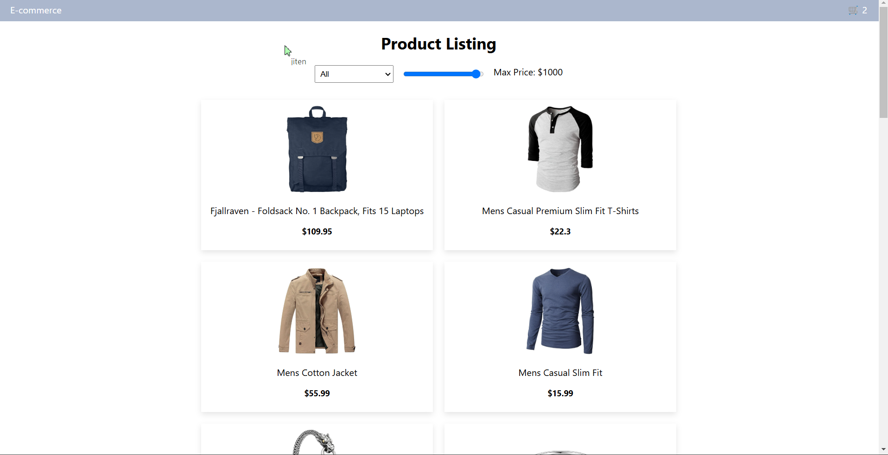
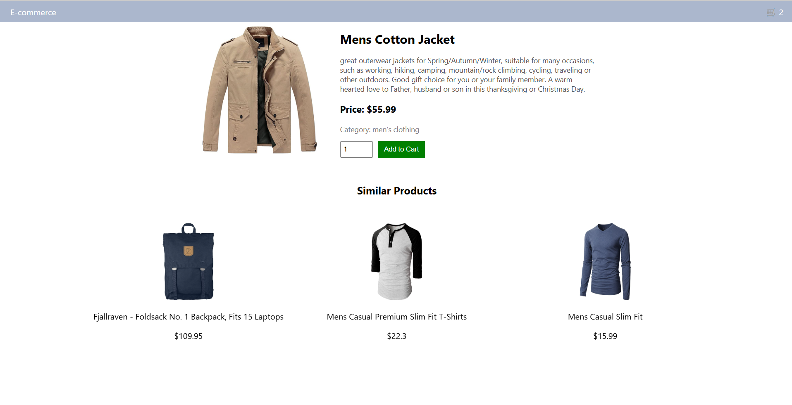

# 📦 E-Commerce Product Listing

A simple e-commerce product listing and details page built with **React** and **FakeStoreAPI**.

## 🚀 Features
- Fetches products from **FakeStoreAPI**.
- Displays product cards with **name, image, and price**.
- Filters products based on **category and price**.
- Shows **detailed product page** with full information.
- Allows users to **add products to the cart** with quantity selection.
- Displays a **carousel of similar products** based on category.

## 📂 Project Structure
```
📦 e-commerce-website
├── 📂 src
│   ├── 📂 components
│   │   ├── Navbar.js
│   │   ├── ProductCard.js
│   │   ├── Cart.js
│   ├── 📂 pages
│   │   ├── ProductListing.js
│   │   ├── ProductDetails.js
│   ├── App.js
│   ├── index.js
├── package.json
├── README.md
```

## ⚡ Installation & Setup
1️⃣ Clone this repository:  
```sh
git clone https://github.com/Cha-rvi/e-commerce.git
```
2️⃣ Navigate to the project folder:  
```sh
cd e-commerce-website
```
3️⃣ Install dependencies:  
```sh
npm install
```
4️⃣ Start the development server:  
```sh
npm start
```
The app will run on `http://localhost:3000/` 🚀

## 🔗 API Used
- [FakeStoreAPI](https://fakestoreapi.com/products) for fetching product data.

## 🎨 Screenshots
### 🏠 Product Listing Page


### 🛍️ Product Details Page


## 🤝 Contributing
Feel free to contribute! Fork the repo, make changes, and submit a **pull request**.

